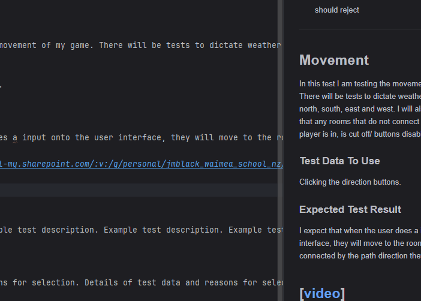

# Plan for Testing the Program

The test plan lays out the actions and data I will use to test the functionality of my program.

Terminology:

- **VALID** data values are those that the program expects
- **BOUNDARY** data values are at the limits of the valid range
- **INVALID** data values are those that the program should reject

---
For my testing, I will be using Screen to Gif screen recorder.

## TEST Gif

---

## Movement

In this test I am testing the movement of my game. There will be tests to dictate weather the user can move north, south, east and west. I will also be making sure that any rooms that do not connect to the room the player is in, is cut off/ buttons disabled.
### Test Data To Use

For my testing I will be using the 

### Expected Test Result

I expect that when the user does a input onto the user interface, they will move to the room that was connected by the path direction they clicked.

---

## Oxygen

For the oxygen system, I need to test the depletion of the oxygen per step/entering of room. I also have to make sure the gain oxygen mechanic works and cannot be used for farming/repeated use (Cheating).

### Test Data To Use

Will be using the oxygen bar, entering the oxygen room (N,S,E,W keys) and the mechanic of sending the player back if they run out of air.

### Expected Test Result

I expect the test results to show the reader/ user that for every step/ traversal into another room, they lose oxygen. When the player enters the oxygen room I need the oxygen bar to indicatew a increase in air, and the system to note that the player has increased their air by +3. Also, if the player runs out of air, they are sent back to the start and have to restart.

---

## Map

When it comes to testing the Map system/Ui, I need to make sure that the button that opens the map ui works perfectly and I also need to test that the map shows up and works alongside of the control panel.

### Test Data To Use

Testing the map Ui/ window and the button that opens the map window.

### Expected Test Result

I expect that the map window will pop up after the player/ user has pressed the map button.

---

## Winning the game

For testing this, I need to complete the game and then show to the audience what happens when the player enters the finish room / pods room.

### Test Data To Use

Entering the pods room, Showing of the end-game pop up.

### Expected Test Result

I expect that there will be a pop-up saying that the player has completed the game after they get to the pods room. After that when they click the final button, the game panel closes.

---

