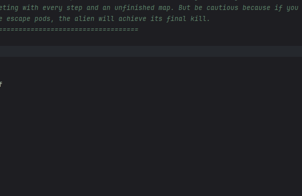
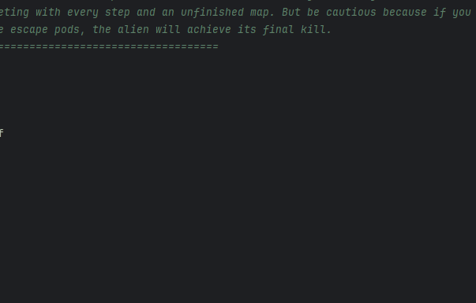
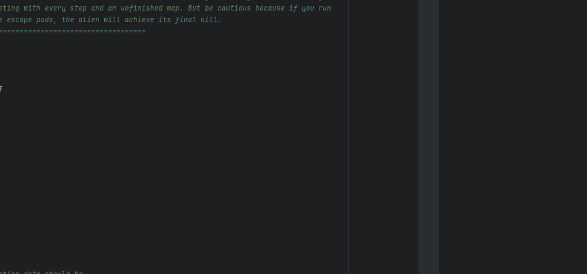

# Results of Testing

The test results show the actual outcome of the testing, following the [Test Plan](test-plan.md)

---

## Movement
In the video, I tested the player's movement mechanics around the game map, making sure there was smooth navigation between the interconnected rooms. Additionally, I made sure that paths leading to non-existent rooms were blocked to prevent the player from accessing them. This ensures the game world remains a challenge and prevents them from getting stuck or unintended exploration.

## Test Data Used
Movement is the core mechanic of my game, making this the most important test. I made sure that functionality of the North, South, East, and West directional buttons respond correctly and move the player between rooms as intended.

## Test Result

The test was successful—movement controls worked flawlessly, allowing seamless travel between connected rooms. Paths that didn’t lead anywhere were correctly disabled, keeping the game’s intended design.

---

## Oxygen
This test is for the oxygen management system, the key difficulty mechanic in the game. The oxygen bar should deplete with each step or room transition, and if it reaches zero, the player respawns in the starting room. Additionally, I tested the oxygen-refill room to make sure it restores oxygen only once, preventing the players from using this to their advantage.

## Test Data Used
Oxygen Depletion: Confirmed the bar decreases per movement.
Game Resetting: I made sure the player respawns upon using all their oxygen.
Oxygen Refill: Carefully tested the oxygen room use/ functionality to prevent infinite oxygen farming (Lol).

## Test Result

The oxygen system worked as intended. The refill room gives the player +3 oxygen but only once, eliminating a potential gameplay loophole. This balance ensures that it is still a challenge and introduces strategy into the game.

---

## Map
To enhance player immersion and navigation, I implemented a small, low-detail map. This design choice avoids confusing the player too much while providing just enough of a challenge to traverse the ship.

## Test Data Used
Map UI: Tested toggle functionality (opening/closing).
Map Button: Verified it displays the map without disrupting gameplay.

## Test Result

The map functioned correctly, offering players who get confused an easier time playing without breaking immersion. If I had more time, I’d make the map look good, but it still works perfectly.

---

## Winning the Game
Getting to the escape pod room is the way the player beats the game. This test shows/ ensures the end-game pop-up appears upon reaching the room/pods, telling the player that they have won and the game was completed.

## Test Data Used
Escape Pod Interaction: Confirmed the trigger for the win condition.
Pop-up Display: Verified visibility and messaging (e.g., "Mission Successful").

## Test Result

The pop-up appeared as it was supposed too, delivering a hopefully satisfying ending. Without it, players might feel uncertain about weather they finished, so it is vital for this to be there.

---
